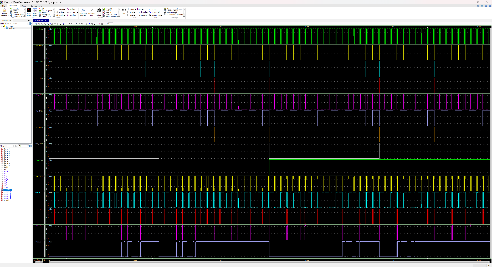
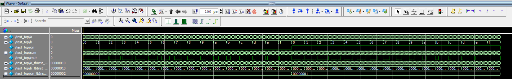

# ZSpice Verilog Synthesizer

## 基础功能

本项目可以将Verilog代码（RTL级）转为晶体管级spice子电路网表，支持自定义工艺库、自定义逻辑门子电路网表、自定义晶体管参数、Verilog模块引用spice网表、生成Transient Analysis脚本等功能，本程序主要针对Synopsys HSpice开发。

## 运行示例

### 示例文件

在项目目录下，有如下示例文件：

```
./examples/
├── adders.v
├── subckt.sp
└── top.v
```

`adders.v`定义了半加器模块`hadd`和1位全加器模块`add1`，其中半加器模块`hadd`被编译指令对``` `celldefine```和``` `endcelldefine```标记为cell模块：

```verilog
//adders.v
module add1 (input a,
             input b,
             input cin,
             output sum,
             output cout);
    wire s,c1,c2;
    hadd hadd1(.a(a),.b(b),.s(s),.c(c1));
    hadd hadd2(.a(s),.b(cin),.s(sum),.c(c2));
    assign cout = c1 | c2;
endmodule
    
`celldefine
module hadd(input a,input b,output s,output c);
    assign s = a ^ b;
    assign c = a & b;
endmodule
`endcelldefine
```
`subckt.sp`定义了上文`hadd`模块的子电路，由于此模块被标记为cell模块，在综合时会综合为sp网表文件中的同名子电路：

```sp
*subckt.sp
.SUBCKT hadd a b s c
Mp1 buf1 a VDD VDD PMOS_3P3 L=LP W=2*WP
Mp2 out_buf b buf1 buf1 PMOS_3P3 L=LP W=2*WP
Mn1 out_buf a GND GND NMOS_3P3 L=LN W=WN
Mn2 out_buf b GND GND NMOS_3P3 L=LN W=WN
XAND a b c AND
Mp3 buf out_buf VDD VDD PMOS_3P3 L=LP W=2*WP
Mp4 s c buf buf PMOS_3P3 L=LP W=2*WP
Mn3 s out_buf GND GND NMOS_3P3 L=LN W=WN
Mn4 s c GND GND NMOS_3P3 L=LN W=WN
.ENDS hadd
```

`top.v`定义了top_module，功能为4位级联加法器，示例化了4个1位加法器：

```verilog
module top_module(input [3:0] a,b,
                  input cin,
                  output[3:0] sum,
                  output cout);
    wire [3:0]carry_out,carry_in;
    assign cout          = carry_out[3];
    assign carry_in[0]   = cin;
    assign carry_in[3:1] = carry_out[2:0];
    add1 add[3:0](.a(a),.b(b),.cin(carry_in),.cout(carry_out),.sum(sum));
endmodule
```

### 综合结果

在命令行中运行

```bash
$ perl ./src/main.pl ./examples --ignoreFiles tb.v --top top.v -o top.sp --process sm046005-1j.hspice --voltage 3.3 --model SC -t=sweep --tbIterMax 16 --timescale us --tbStep 0.01 --tbPulse 5 --capacitorLoad 1pF --WP 2u --clearCache
```

`./src/main.pl`为主程序，
`./examples`指定输入目录为`./examples`，
`--ignoreFiles tb.v`综合时忽略文件tb.v，多个文件用逗号隔开
`--top top.v`指定top_module所在的文件为`top.v`（若无此参数则会自动选取输入文件夹内唯一的.v文件或名字带有top的.v文件），会自动指定此文件内名字内带有top的模块作为顶层模块，
`--process sm046005-1j.hspice`指定工艺库为`sm046005-1j.hspice`（如无指定则默认sm046005-1j.hspice），
`--voltage 3.3`指定$V_{DD}=3.3V$（如无指定则默认$V_{DD}=3.3V$），
`--model SC`指定门模块模型为`SC`（静态互补）（如无指定则默认SC），
`-t=sweep`指定需要生成瞬态分析的激励源和RTL仿真激励文件（生成在\$\{inputPath\}/output/testbench/testbench.v中），生成模式为扫描所有可能输入模式，
`--tbIterMax 16`设定RTL仿真激励文件中每个输入信号最大仿真种类数为16，避免大模块仿真时间过长，
`--timescale us`指定瞬态分析参数的时间单位为$\mu s$（如无指定默认为$ns$），
`--tbStep 0.01`指定瞬态分析最大步长为$0.01\mu s$（如无指定默认为$0.01ns$），
`--tbPulse 5`指定瞬态分析激励源最小脉宽为$5\mu s$（如无指定默认为$10ns$），
`--capacitorLoad 1pF`指定输出负载电容为$1pF$（如无指定默认为$0.01pF$），
`--WP 2u`指定全局PMOS单位宽度为$2\mu m$（如无指定默认为$3.5\mu m$）
`--clearCache`清理\$\{inputPath\}/output/tmp文件夹

程序会在输入目录下的`output`文件夹中生成带有激励源的网表文件，激励源会对所有的输入情况进行激励。上述脚本会输出`./examples/output/top.sp`:

```sp
.LIB sm046005-1j.hspice typical
.OPTION POST
.PARAM WN=1u LP=0.35u LN=0.35u WP=2u


.GLOBAL VDD GND
VDD VDD GND 3.3

.SUBCKT INV nc in out
.LIB sm046005-1j.hspice typical
Mp out in VDD VDD PMOS_3P3 L=LP W=WP
Mn out in GND GND NMOS_3P3 L=LN W=WN
.ENDS INV

.SUBCKT OR in1 in2 out
.LIB sm046005-1j.hspice typical
Mp1 buf in1 VDD VDD PMOS_3P3 L=LP W=2*WP
Mp2 out_buf in2 buf buf PMOS_3P3 L=LP W=2*WP
Mn1 out_buf in1 GND GND NMOS_3P3 L=LN W=WN
Mn2 out_buf in2 GND GND NMOS_3P3 L=LN W=WN
XINV GND out_buf out INV
.ENDS OR

.SUBCKT XOR in1 in2 out
.LIB sm046005-1j.hspice typical
XINV_1 GND in1 in1_n INV
XINV_2 GND in2 in2_n INV
Mp1 buf1 in1 VDD VDD PMOS_3P3 L=LP W=2*WP
Mp2 out in2_n buf1 buf1 PMOS_3P3 L=LP W=2*WP
Mp3 buf2 in1_n VDD VDD PMOS_3P3 L=LP W=2*WP
Mp4 out in2 buf2 buf2 PMOS_3P3 L=LP W=2*WP
Mn1 out in1 buf3 buf3 NMOS_3P3 L=LN W=2*WN
Mn2 out in2_n buf3 buf3 NMOS_3P3 L=LN W=2*WN
Mn3 buf3 in1_n GND GND NMOS_3P3 L=LN W=2*WN
Mn4 buf3 in2 GND GND NMOS_3P3 L=LN W=2*WN
.ENDS XOR

.SUBCKT AND in1 in2 out
.LIB sm046005-1j.hspice typical
Mp1 out_buf in1 VDD VDD PMOS_3P3 L=LP W=WP
Mp2 out_buf in2 VDD VDD PMOS_3P3 L=LP W=WP
Mn1 out_buf in1 buf buf NMOS_3P3 L=LN W=2*WN
Mn2 buf in2 GND GND NMOS_3P3 L=LN W=2*WN
XINV GND out_buf out INV
.ENDS AND

.SUBCKT top_module a_0 b_0 a_1 b_1 a_2 b_2 a_3 b_3 cin sum_0 sum_1 sum_2 sum_3 cout
.LIB sm046005-1j.hspice typical
Rshort_cout cout carry_out_3 0
Rshort_carry_in_0 carry_in_0 cin 0
Rshort_carry_in_1 carry_in_1 carry_out_0 0
Rshort_carry_in_2 carry_in_2 carry_out_1 0
Rshort_carry_in_3 carry_in_3 carry_out_2 0
Xadd_01000 a_0 b_0 carry_in_0 sum_0 carry_out_0 add1
Xadd_11001 a_1 b_1 carry_in_1 sum_1 carry_out_1 add1
Xadd_21002 a_2 b_2 carry_in_2 sum_2 carry_out_2 add1
Xadd_31003 a_3 b_3 carry_in_3 sum_3 carry_out_3 add1
.ENDS top_module

.SUBCKT hadd a b s c
.LIB sm046005-1j.hspice typical
Mp1 buf1 a VDD VDD PMOS_3P3 L=LP W=2*WP
Mp2 out_buf b buf1 buf1 PMOS_3P3 L=LP W=2*WP
Mn1 out_buf a GND GND NMOS_3P3 L=LN W=WN
Mn2 out_buf b GND GND NMOS_3P3 L=LN W=WN
XAND a b c AND
Mp3 buf out_buf VDD VDD PMOS_3P3 L=LP W=2*WP
Mp4 s c buf buf PMOS_3P3 L=LP W=2*WP
Mn3 s out_buf GND GND NMOS_3P3 L=LN W=WN
Mn4 s c GND GND NMOS_3P3 L=LN W=WN
.ENDS hadd

.SUBCKT add1 a b cin sum cout
.LIB sm046005-1j.hspice typical
XOR1004 c1 c2 cout OR
Xhadd11005 a b s c1 hadd
Xhadd21006 s cin sum c2 hadd
.ENDS add1


X_TOP a_0 b_0 a_1 b_1 a_2 b_2 a_3 b_3 cin sum_0 sum_1 sum_2 sum_3 cout top_module
C_sum_0 sum_0 GND 1pF
C_sum_1 sum_1 GND 1pF
C_sum_2 sum_2 GND 1pF
C_sum_3 sum_3 GND 1pF
C_cout cout GND 1pF


V_a_0 a_0 GND PULSE(0V 3.3V 5us 0us 0us 5us 10us)
V_b_0 b_0 GND PULSE(0V 3.3V 10us 0us 0us 10us 20us)
V_a_1 a_1 GND PULSE(0V 3.3V 20us 0us 0us 20us 40us)
V_b_1 b_1 GND PULSE(0V 3.3V 40us 0us 0us 40us 80us)
V_a_2 a_2 GND PULSE(0V 3.3V 80us 0us 0us 80us 160us)
V_b_2 b_2 GND PULSE(0V 3.3V 160us 0us 0us 160us 320us)
V_a_3 a_3 GND PULSE(0V 3.3V 320us 0us 0us 320us 640us)
V_b_3 b_3 GND PULSE(0V 3.3V 640us 0us 0us 640us 1280us)
V_cin cin GND PULSE(0V 3.3V 1280us 0us 0us 1280us 2560us)


.TRAN 0.01us 2560us

.END
```

使用HSpice对`top.sp`进行仿真后，即有如下波形：


程序也会在output/testbench目录下生成RTL仿真激励文件`testbench.v`：
```verilog
`timescale 1ns/1ps
`include "top.v"


module test_top();
	reg  [	3	:	0	]	a;
	reg  [	3	:	0	]	b;
	reg 	cin;
	wire [	3	:	0	]	sum;
	wire	cout;
	top_module top_inst(
		.a		(		a),
		.b		(		b),
		.cin		(		cin),
		.sum		(		sum),
		.cout		(		cout)
	);

	integer a_tbInst_iter, b_tbInst_iter, cin_tbInst_iter;

	initial begin
		cin = 1'b0;
		for(cin_tbInst_iter = 0; cin_tbInst_iter < 2; cin_tbInst_iter = cin_tbInst_iter + 1) begin
			b = 4'b0;
			for(b_tbInst_iter = 0; b_tbInst_iter < 16; b_tbInst_iter = b_tbInst_iter + 1) begin
				a = 4'b0;
				for(a_tbInst_iter = 0; a_tbInst_iter < 16; a_tbInst_iter = a_tbInst_iter + 1) begin
					#5;
					a = a + 1;
				end
				b = b + 1;
			end
			cin = cin + 1;
		end
	end
endmodule
```

同时也会在上述目录下生成ModelSim仿真脚本`autorun.tcl`:

```tcl
quit -sim
vlib work
vlog adders.v top.v testbench.v
vsim work.test_top -voptargs="+acc"
view wave
delete wave *
add wave sim:/test_top/*
radix -hex
run -all
```

如果环境变量中有ModelSim，会自动运行仿真脚本，并打开波形图



## 环境要求

### 运行环境要求

#### `perl` 

Linux自带，Windows可以安装Strawberry Perl

#### `cpan` 

Linux自带，Windows可以安装Strawberry Perl里面自带

#### `Log::Dispatch` 

apt包管理器系统运行

```bash
$ sudo apt install liblog-dispatch-perl
```

Windows在命令行内运行

```powershell
> cpan Log::Dispatch
```

### 开发环境要求

建议在WSL Linux下开发，Perl的Language Server目前只能在Linux下运行，HSpice大家基本都装在Windows里面（如果装在Linux内当我没说），WSL可以允许Linux系统操作Windows系统内的文件，比VMWare的挂载共享文件夹方便多了。

#### `WSL+Ubuntu`（*可选）

用于跨平台开发与调试

#### `vscode`（*可选）

用于跨平台开发与调试

#### `wget` `ca-certificates` `build-essential` 

必要的编译工具和下载工具，apt包管理器系统运行
```bash
$ sudo apt install wget ca-certificates build-essential
```

#### `libanyevent-perl` `libio-aio-perl` `Perl::LanguageServer` （*可选）

用于VSCode调试，apt包管理器系统运行
```bash
$ sudo apt install libanyevent-perl libio-aio-perl && sudo cpan Perl::LanguageServer
```

#### `graphviz` `libexpat1-dev` `libx11-dev` `perl-tk` （*可选）

用于数据结构可视化，apt包管理器系统运行
```bash
$ sudo install graphviz perl-tk
```

## 语法限制

目前仅仅支持RTL级建模，不支持行为级建模。

### 支持的语句

支持的语句和运算符包括：

#### assign

允许对线网与线网总线赋值，允许`~&|^`运算符，暂不支持规约运算，暂不支持`{}`线网连接，暂不支持`?:`三元运算符。

#### module

允许定义模块，定义模块的时候需要声明输入与输出线网与线网总线类型`input|output`，暂不支持`inout`类型和模块内部声明类型。

#### wire

允许定义线网和线网总线。

#### 注释

允许使用//进行注释。

#### 模块例化

允许例化模块，允许例化模块Array，暂不支持generate。
例化模块需要使用端口名称进行例化，暂不支持根据声明位置进行例化。
例化连接的端口必须为线网名称与索引，暂不支持表达式。


### 后续更新打算，目前暂时不支持

### 规约运算

`^&|`的规约运算

### MUX

`?:`三元运算符

### 复杂总线连接

`{}`连接运算

### 模块声明与例化

按照位置例化，端口为表达式

### 组合逻辑综合

组合逻辑自动综合为静态互补逻辑，而非逻辑门级联